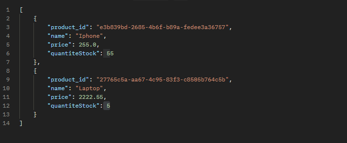

## Simple crud application using Spring Boot, Casaandra and Docker

Run the following command to test the project:
```bash
docker-compose up
```
Enter the Cassandra container:
```bash
docker exec -it 4c924bcbbd32 cqlsh --request-timeout=6000
```
create a keyspace:
```cassandraql
CREATE KEYSPACE store WITH REPLICATION = { 'class' : 'SimpleStrategy', 'replication_factor' : 1 };
```


Create table called "product" with the following schema:
```cassandraql
CREATE TABLE store.product (
    product_id UUID PRIMARY KEY,
    name TEXT,
    price DOUBLE,
    quantiteStock INT
);
```
Insert some data into the table:
```cassandraql
INSERT INTO store.product (product_id, name, price, quantiteStock) VALUES (uuid(), 'Iphone', 255.0, 55);
INSERT INTO store.product (product_id, name, price, quantiteStock) VALUES (uuid(), 'Laptop', 2222.55, 5);
```


The application will be available at http://localhost:8080

### Endpoints
- GET /products - List all products
- GET /products/{id} - Get a product by id
- POST /products - Create a new product
- DELETE /products/{id} - Delete a product by id

### Example of a product
```json
 {
  "product_id": "e3b839bd-2685-4b6f-b89a-fedee3a36757",
  "name": "Iphone",
  "price": 255.0,
  "quantiteStock": 55
}
```
### test the endpoints using curl or postman
```bash
curl -X POST -H "Content-Type: application/json" -d '{"name": "Iphone", "price": 255.0, "quantiteStock": 55}' http://localhost:8080/products
```
```bash
curl -X GET http://localhost:8080/products
```
```bash
curl -X GET http://localhost:8080/products/e3b839bd-2685-4b6f-b89a-fedee3a36757
```
```bash
curl -X DELETE http://localhost:8080/products/e3b839bd-2685-4b6f-b89a-fedee3a36757
```

### get all products response


### Technologies
- Spring Boot
- Cassandra
- Docker
- Docker Compose
- Maven
- Java 17